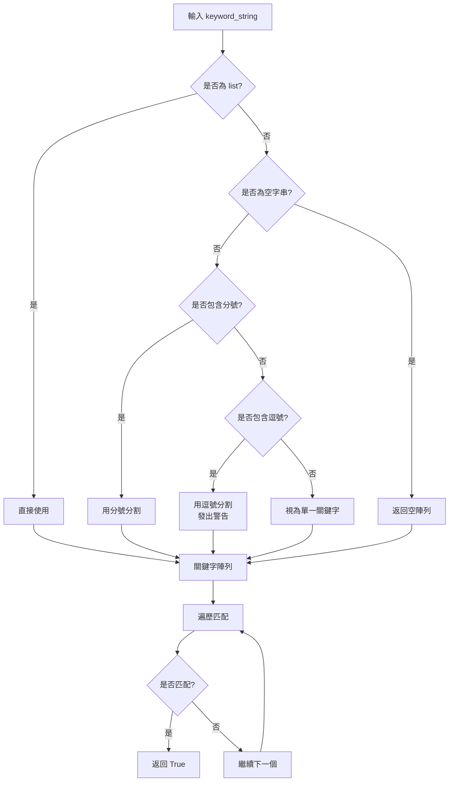

# API 契約：關鍵字格式規範

**功能**：002-keyword-delimiter-fix
**版本**：2.0.0 (BREAKING CHANGE)
**生效日期**：2025-10-28

## 概述

定義 Tickets Hunter 搶票系統中所有關鍵字欄位的格式規範，包括分隔符號、解析邏輯與向後相容性策略。

## 格式規範

### 新格式（推薦，2025-10-28 起）

**分隔符號**：分號（`;`）

**適用欄位**：
- `date_auto_select.date_keyword`
- `area_auto_select.area_keyword`
- `keyword_exclude`
- `advanced.idle_keyword`
- `advanced.resume_keyword`
- `advanced.idle_keyword_second`
- `advanced.resume_keyword_second`

**範例**：
```json
{
  "date_keyword": "10/03;10/05;10/07",
  "area_keyword": "3,280;2,680;1,980",
  "keyword_exclude": "輪椅;身障;視線受阻",
  "idle_keyword": "09:30:00;14:15:30",
  "resume_keyword": "09:30:05;14:15:35"
}
```

**解析規則**：
1. 使用分號 `;` 分割字串
2. 每個關鍵字自動去除前後空白（`strip()`）
3. 空關鍵字自動過濾
4. 保留關鍵字內部的逗號（例如：`"3,280"` 作為完整字串）

**Python 實作**：
```python
keywords = [kw.strip() for kw in keyword_string.split(';') if kw.strip()]
```

---

### 替代格式（進階選項）

**格式**：JSON 陣列

**範例**：
```json
{
  "date_keyword": ["10/03", "10/05", "10/07"],
  "area_keyword": ["3,280", "2,680", "1,980"],
  "keyword_exclude": ["輪椅", "身障", "視線受阻"]
}
```

**解析規則**：
1. 直接使用 Python list
2. 無需額外處理
3. 每個元素視為獨立關鍵字

**優點**：
- 明確無歧義
- 支援複雜字串（包含任意字元）

**缺點**：
- 使用者輸入複雜（需要引號、方括號）
- 不符合「設定驅動開發」原則（使用者友善性）

---

### 舊格式（已廢棄，2025-09-22 - 2025-10-28）

**分隔符號**：逗號（`,`）

**範例**：
```json
{
  "date_keyword": "10/03,10/05,10/07",
  "area_keyword": "A區,B區,C區"
}
```

**問題**：
- 與金額千位分隔符號衝突（例如：`"3,280"` 被分割為 `["3", "280"]`）
- 與時間格式衝突（例如：`"09:30:00,14:15:30"` 被分割為 6 個部分）

**向後相容性策略**：
- 舊格式仍可運作（不阻斷系統啟動）
- 偵測到舊格式時發出警告訊息
- 建議使用者更新為新格式

**警告訊息範例**：
```
[WARNING] 偵測到舊格式的關鍵字設定
[WARNING] 當前設定: "10/03,10/05"
[WARNING] 建議格式: "10/03;10/05"
[WARNING] 或使用 JSON 陣列: ["10/03", "10/05"]
```

---

## 解析邏輯

### 函數簽章

```python
def is_text_match_keyword(keyword_string: str | list, text: str) -> bool:
    """
    判斷文字是否匹配關鍵字

    Args:
        keyword_string: 關鍵字字串或陣列
            - 字串：使用分號 (;) 或逗號 (,) 分隔
            - 陣列：直接使用
        text: 待匹配的文字

    Returns:
        bool: 是否匹配成功

    Examples:
        >>> is_text_match_keyword("10/03;10/05", "2025/10/03 演唱會")
        True

        >>> is_text_match_keyword("3,280;2,680", "NT$ 3,280 元")
        True

        >>> is_text_match_keyword(["3,280", "2,680"], "NT$ 3,280 元")
        True

        >>> is_text_match_keyword("A區,B區", "搖滾A區")  # 舊格式，觸發警告
        True
    """
```

### 解析流程



---

## 向後相容性

### 偵測邏輯

**觸發條件**：
```python
if ',' in keyword_string and ';' not in keyword_string and not '"' in keyword_string:
    # 偵測到舊格式
```

**警告輸出**：
```python
if config_dict["advanced"].get("verbose", False):
    print("[WARNING] 偵測到舊格式的關鍵字設定")
    print(f"[WARNING] 當前設定: {keyword_string}")
    print(f"[WARNING] 建議格式: {keyword_string.replace(',', ';')}")
    print("[WARNING] 或使用 JSON 陣列格式")
```

### 遷移指南

**步驟 1**：開啟 `settings.json`

**步驟 2**：搜尋所有關鍵字欄位：
- `date_keyword`
- `area_keyword`
- `keyword_exclude`
- `idle_keyword`
- `resume_keyword`
- `idle_keyword_second`
- `resume_keyword_second`

**步驟 3**：將所有逗號 `,` 替換為分號 `;`

**步驟 4**：儲存檔案並重新執行程式

**範例**：
```json
// Before (舊格式)
{
  "date_keyword": "10/03,10/05",
  "area_keyword": "3,280,2,680"
}

// After (新格式)
{
  "date_keyword": "10/03;10/05",
  "area_keyword": "3,280;2,680"
}
```

---

## 測試案例

### 案例 1：分號分隔的多關鍵字

**輸入**：
```python
keyword_string = "10/03;10/05;10/07"
text = "2025/10/05 演唱會"
```

**預期輸出**：
```python
True  # 匹配第二個關鍵字 "10/05"
```

---

### 案例 2：包含逗號的單一關鍵字（金額）

**輸入**：
```python
keyword_string = "3,280"
text = "NT$ 3,280 元"
```

**預期輸出**：
```python
True  # 完整匹配 "3,280"
```

---

### 案例 3：包含逗號的多關鍵字（金額）

**輸入**：
```python
keyword_string = "3,280;2,680;1,980"
text = "NT$ 2,680 元"
```

**預期輸出**：
```python
True  # 匹配第二個關鍵字 "2,680"
```

---

### 案例 4：JSON 陣列格式

**輸入**：
```python
keyword_string = ["3,280", "2,680", "1,980"]
text = "NT$ 3,280 元"
```

**預期輸出**：
```python
True  # 匹配第一個元素
```

---

### 案例 5：舊格式偵測（觸發警告）

**輸入**：
```python
keyword_string = "10/03,10/05"  # 舊格式
text = "2025/10/03 演唱會"
config_dict["advanced"]["verbose"] = True
```

**預期輸出**：
```python
True  # 匹配成功

# 同時輸出警告訊息：
[WARNING] 偵測到舊格式的關鍵字設定
[WARNING] 當前設定: "10/03,10/05"
[WARNING] 建議格式: "10/03;10/05"
[WARNING] 或使用 JSON 陣列: ["10/03", "10/05"]
```

---

### 案例 6：空白處理

**輸入**：
```python
keyword_string = " 10/03 ; 10/05 ; 10/07 "
text = "2025/10/05 演唱會"
```

**預期輸出**：
```python
True  # 自動去除空白後匹配
```

---

### 案例 7：空關鍵字過濾

**輸入**：
```python
keyword_string = "10/03;;10/05"  # 中間有空關鍵字
text = "2025/10/05 演唱會"
```

**預期輸出**：
```python
True  # 自動過濾空關鍵字，匹配 "10/05"
```

---

## 變更歷史

| 版本 | 日期 | 變更內容 | 類型 |
|------|------|---------|------|
| 2.0.0 | 2025-10-28 | 分隔符號從逗號改為分號 | BREAKING CHANGE |
| 1.1.0 | 2025-09-22 | 新增自動逗號分割功能 | 功能新增 |
| 1.0.0 | 2023-07-17 | 初始版本（引號保護機制） | 初始發佈 |

---

## 參考資料

- **Issue**：GitHub Issue #23
- **規格**：`specs/002-keyword-delimiter-fix/spec.md`
- **計畫**：`specs/002-keyword-delimiter-fix/plan.md`
- **研究**：`specs/002-keyword-delimiter-fix/research.md`
- **實作**：`src/util.py:is_text_match_keyword()`
- **憲法**：`.specify/memory/constitution.md`（第 V 條：設定驅動開發）
